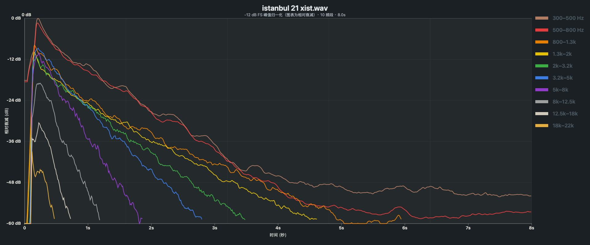

# Cymbal Decay Visualizer

镲片录音音色衰减分析工具：将录音拖入浏览器，即可查看 10 个频段随时间变化的相对衰减曲线，并比较不同镲片的衰减特征。

## 当前功能

- 拖放或选择 WAV、MP3、AIFF、FLAC、OGG、M4A 音频
- 自适应多窗口 STFT
- 300 Hz–22 kHz 的 10 个对数频段
- 单文件衰减曲线分析
- 多文件逐次追加，不覆盖已有分析
- 左右翻页查看已分析文件
- 当前文件单独删除，或一键清空全部文件
- 多文件对比模式
- 起音统一检测与对齐
- 对齐后仅保留 `-0.2s` 的起音前导
- 物理衰减 / 第一阶段相对听觉贡献视图
- 对比图 X/Y 轴缩放
- 静态 PNG 导出，并嵌入分析数据
- 动态视频导出：根据浏览器能力自动选择 MP4 或 WebM（不限定 Safari；若当前浏览器不支持任何可用格式，会显示提示）

## 使用方法

用 Safari 打开：

```bash
open -a Safari index.html
```

也可以直接双击 `index.html`。

## 开发说明

本项目由 **jindabin** 设计，代码由 **Hermes Agent** 完成。

## 分析说明

处理流程：

```text
音频解码 → mono → 峰值归一化到 -12 dB FS
→ 自适应多窗口 STFT
→ 10 个频段 RMS 聚合
→ dB 曲线
→ 相对归一化
→ 图表显示
```

目前的“听觉贡献”是第一阶段近似模型，只用于同一录音体系内的相对比较，不等同于 ISO 532-1、phon、sone 或经过 dB SPL 校准的响度测量。

## 浏览器权限

浏览器第一次使用音频分析时，可能需要允许页面使用音频相关能力。音频只在本地浏览器中处理，不会自动上传到服务器。

## English

# Cymbal Decay Visualizer

A browser-based tool for visualizing cymbal-recording decay across ten frequency bands.

Drop an audio file into the page to inspect its relative decay curves, or load multiple recordings to compare their sustain behavior and onset alignment.

### Features

- Drag-and-drop or file-picker support for WAV, MP3, AIFF, FLAC, OGG, and M4A
- Adaptive multi-window STFT
- Ten logarithmic frequency bands from 300 Hz to 22 kHz
- Single-file decay visualization
- Append additional files without replacing previous analyses
- Previous/next navigation through analyzed files
- Delete the current analysis without deleting the others
- Multi-file comparison mode
- Unified onset detection and alignment
- Comparison view with only 0.2 seconds of pre-onset context
- Physical decay and first-stage relative auditory-contribution views
- X/Y comparison zoom
- PNG export with embedded analysis data
- Video export selected by browser capability: MP4 when supported, otherwise WebM

### Usage

Open `index.html` in a modern browser. You can also double-click the file.

Recommended browsers: Safari, Chrome, Edge, or Firefox.

Audio analysis requires the Web Audio API. Audio is processed locally in the browser and is not automatically uploaded.

### Development note

Designed by **jindabin**. Code completed by **Hermes Agent**.

### Analysis method

```text
Audio decode → mono → peak normalization to -12 dB FS
→ adaptive multi-window STFT
→ ten-band RMS aggregation
→ dB curves
→ relative normalization
→ visualization
```

The auditory-contribution view is a first-stage approximation for relative comparison within the same recording workflow. It is not an ISO 532-1, phon, sone, or calibrated dB SPL measurement.

### Browser compatibility

Audio analysis requires a browser with the Web Audio API.

Video export requires `MediaRecorder` and a supported video MIME type. The tool checks browser capabilities at runtime instead of assuming Safari. It tries MP4 first, then WebM VP9/VP8. If no supported format is available, it displays a warning instead of silently failing.

### English example



### Example video

[Download or play the Istanbul 21 Xist decay demonstration video](screenshots/istanbul-21-xist-decay-demo.mp4)

---

## 许可证 / License

本项目采用源码可见、个人与非商业使用许可 / This project is source-available under a personal and non-commercial license:

- 允许个人使用、学习、研究和非商业演示 / Personal, educational, research, and non-commercial demonstration use is permitted.
- 商业使用、销售、再打包、再发布、集成到收费软件或服务，需要事先获得作者书面许可 / Commercial use, resale, redistribution, sublicensing, or incorporation into a paid product or service requires prior written permission.
- 重新发布时必须保留版权和许可证说明 / Copyright and license notices must be retained in permitted redistribution.

详见 [`LICENSE`](LICENSE)。 / See [`LICENSE`](LICENSE).

## Copyright

Copyright © 2026 Jinjue. All rights reserved.
