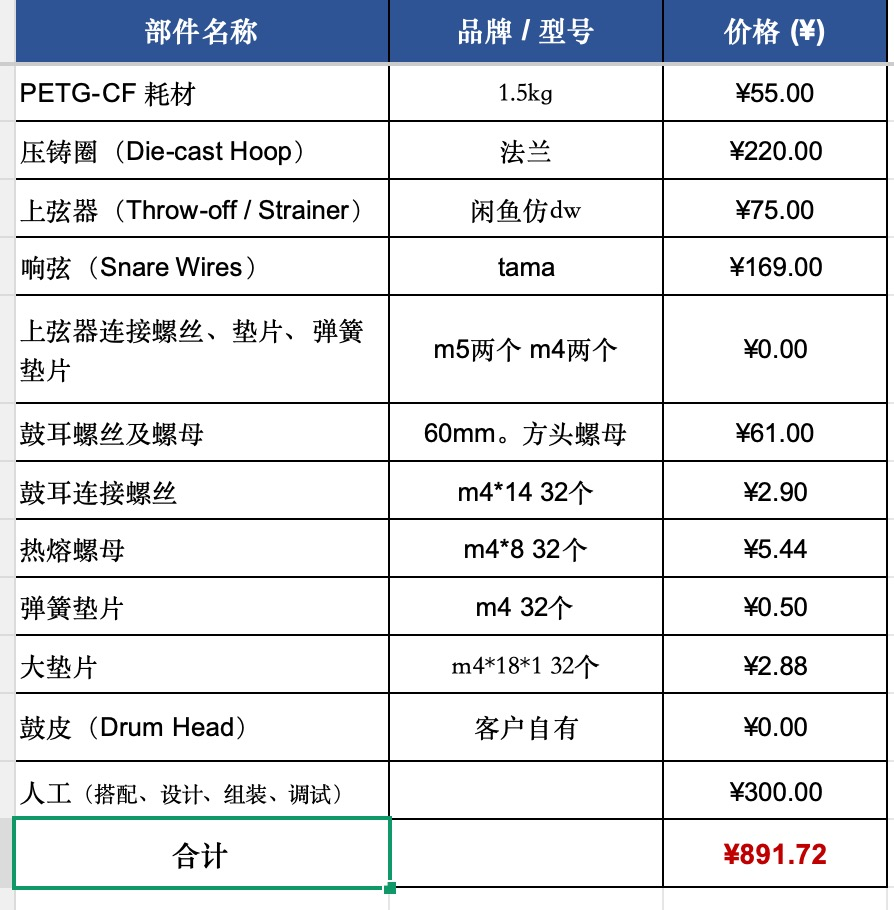

# Cymbal Decay Visualizer

A browser-based tool for visualizing cymbal-recording decay across ten frequency bands.

Drop an audio file into the page to inspect its relative decay curves, or load multiple recordings to compare their sustain behavior and onset alignment.

## Features

- Drag-and-drop or file-picker support for WAV, MP3, AIFF, FLAC, OGG, and M4A
- Adaptive multi-window STFT
- Ten logarithmic frequency bands from 300 Hz to 22 kHz
- Single-file decay visualization
- Append additional files without replacing previous analyses
- Previous/next navigation through analyzed files
- Delete the current analysis without deleting the others
- Multi-file comparison mode
- Unified onset detection and alignment
- Comparison view with only 0.2 seconds of pre-onset context
- Physical decay and first-stage relative auditory-contribution views
- X/Y comparison zoom
- PNG export with embedded analysis data
- Video export selected by browser capability: MP4 when supported, otherwise WebM

## Usage

Open `index.html` in a modern browser:

```bash
open -a Safari index.html
```

You can also double-click the file.

Recommended browsers:

- Safari
- Chrome
- Edge
- Firefox

Audio analysis requires the Web Audio API. The audio is processed locally in the browser and is not automatically uploaded.

## Analysis method

```text
Audio decode → mono → peak normalization to -12 dB FS
→ adaptive multi-window STFT
→ ten-band RMS aggregation
→ dB curves
→ relative normalization
→ visualization
```

The auditory-contribution view is a first-stage approximation for relative comparison within the same recording workflow. It is not an ISO 532-1, phon, sone, or calibrated dB SPL measurement.

## Browser compatibility

Audio analysis requires a browser with the Web Audio API.

Video export requires `MediaRecorder` and a supported video MIME type. The tool checks browser capabilities at runtime instead of assuming Safari. It tries MP4 first, then WebM VP9/VP8. If no supported format is available, it displays a warning instead of silently failing.

## Example



## License

This project is source-available under a personal and non-commercial license:

- Personal, educational, research, and non-commercial demonstration use is permitted.
- Commercial use, resale, redistribution, sublicensing, or incorporation into a paid product or service requires prior written permission.
- Copyright and license notices must be retained in permitted redistribution.

See [`LICENSE`](LICENSE).

## Copyright

Copyright © 2026 Jinjue. All rights reserved.
